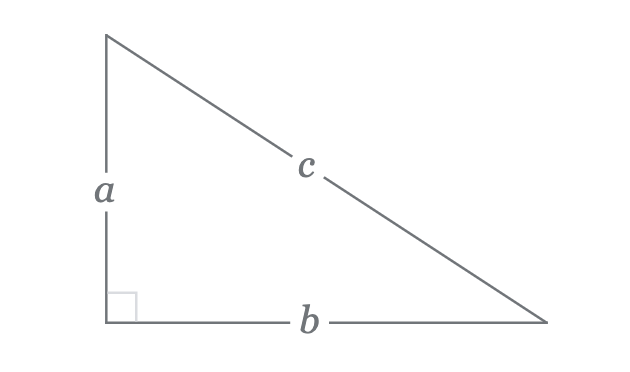

# CSCI 1100 Gateway to Computer Science

## Fall 2022

Robert Muller - Boston College

---

## Lecture Notes
## Week 3

**Topics:**

1. Basic Types, Literals, Operators and Expressions
2. Simplification (aka Evaluation or Reduction) and Values
3. Libraries
4. Function Definitions

---

Like other programming languages, Python is a language designed to express ideas related to computation and information. At the present time, most programming languages, including Python, are text-based: the program code in the language is written out in text (much like these notes) and is then processed by the computer to carry out the expressed computation. In Python, this processing is typically carried out in by an *interpreter* which

 1. prompts the user for and **reads** a Python expression
 2. **evaluates** the expression to find its value if it has one
 3. **prints** the value

For example, a session with Python might look like:

```python
>>> 3.14 * 2.0
6.28
```

Since these 3 steps are done over and over in a **loop**, the setup is often called a REPL.

Programs are consumed by both computers and humans. We try hard to write the code in such a way that a human reader can understand the idea of our program. To assist with this, we'll usually include *comments* that are intended only for the human reader. In Python, any text to the right of a pound sign `#` are understood to be comments which Python ignores.

```python
>>> # This is a comment, Python will ignore it altogether.
```

It's standard practice to include comments at the top of a Python source file introducing the human reader to the code in the file.

----------------

### 1. Basic Types, Literals, Operators and Expressions

In computing, *types* can be understood as sets of "things" (for now) that are the subject of the computation. All programming languages have a number of basic types such as int and float that are built-in to the language. Most programming languages have ways to define new types. We'll get to that subject later in the semester.

Virtually all programming languages have basic types int and float together with built-in operators (e.g., +, -, *, /, %) that work on values of type int and float.

**The `int` Type**

```python
>>> 2   # a literal of type int
2
```

> Every literal is a **value**.

```python
>>> 5 * 2
10

>>> 5 // 2    # integer quotient, remainder discarded
2

>>> 5 % 2     # integer mod, just the remainder
1

>>> 5 / 2     # floating point quotient, the answer is a float
2.5

>>> 2 ** 3    # 2 raised to the 3 - 2 * 2 * 2
8
```

> CONVENTION: Operators should almost always have spaces on either side. So "5 / 2" is good, "5/2" is less good, and both "5 /2" and "5/ 2" are bad.
>
> NB: We'll start omitting the prompt from here on.

In `5 * 2` the `5` and `2` are called *operands* and the `*` is called the *operator*. 

You can enquire about a literal's type using the built-in `type` function.

```python
type(3)
<class 'int'>
```

**Errors**

An error occurs when one of the operands isn't in the domain of the  operator. 

```python
>>> 2 / 0
Traceback (most recent call last):
File "<stdin>", line 1, in <module>
ZeroDivisionError: integer division or modulo by zero
```

**The `float` Type**

```python
>>> 3.14          # a floating point literal
3.14

>>> 2.0 * 3.14    # Note that the same symbol * is used for integer and floating multiply
6.28

>>> .3 + 2.
2.3

>>> 314e-2        # scientific notation means 314 * 10.^-2 = 314 * .01 = 3.14
3.14
```

The built-in operators are interpreted using the familiar PEMDAS order for the operators.

#### Simplification

Computation can be understood as a process of *simplification*.

```python
2.0 + 3.14 * 4.0      # This expression requires 2 computation steps to arrive at a value
 -> 2.0 + 12.56                  
 -> 14.56
```
Since the literal 14.56 cannot be simplified, we call it a *value*.

The standard mathematical order of evaluation can be altered with parenthesization:

```python
(2.0 + 3.14) * 4.0
20.560000000000002         # NB: 15 decimal places of information

5.0 / 2.0
2.5

5.0 % 2.0
1.0                        # floating mod produces a float
```

**Mixing Types** 

It isn't a great idea but most programming languages try to do something sensible. They generally try to *preserve information* by converting literals of the less informative type to the more informative one.

```python
5 * 2.0
10.0
```


The multiply operator sees an `int` on one side, `float` on the the other, it first converts 5 to 5.0 before multiplying.

As we have seen, Python's arithmetic operators are flexible about the types of their operands. (We'll see the same sort of flexibility with some of the built-in functions below.)  The Python documentation  sometimes uses the psuedo-type "number" to suggest this flexibility with types.

**The `string` Type**

```python
>>> "Hello World"         # A string literal. Note that Python prints the answer with single
'Hello World'             # quotes, we'll stick to double quotes in our code.

>>> "Hello" + "World"     # When operands are strings, the + operator concatenates
'HelloWorld'              # No space!

>>> len("Mary")           # Yet another built-in function
4

>>> "Tom" * 3             # This is a strange one!
'TomTomTom'
```

A subject we'll get to later, but we can pick out a letter from a sting.

```python
>>> "Mary"[0]             # Note the square brackets []
'M'                       # The answer is a string of length 1. In most other PLs, the
                          # answer would be a character
```

**The `bool` Type**

There are just two values of this type, the constants `True` and `False`. Note the capital `T` and `F`.

```python
>>> True                  # A boolean literal
True

>>> False
False

>>> true
Traceback (most recent call last):
File "<stdin>", line 1, in <module>
NameError: name 'false' is not defined
```

Although Python can do something reasonable when integers are mixed with floats, as we saw with `"Tom" * 3` above, surprising things can sometimes happen when values of other types are mixed.

```python
>>> True + 4              # DON'T DO THIS!
5
```

**Boolean Operators**

Boolean values can be combined with the `and`, `or` and `not` operators.

```python
>>> True and False
False

>>> True and True
True

>>> True or False
True

>>> not(False)
True

>>> type(True)
<class 'bool'>
```

> Many programming languages use `&&` for `and`, `||` for `or` and `!` for `not`.

#### Relational Operators

Values can often be compared to one another using familiar orderings. 

```python
>>> 2 == 3
False
```

The `==` operator is an *equality* operator. Other common relational operators are `!=` *not equal*, `<` *less than*, `<=` *less than or equal to*, `>` *greater than* or `>=` *greater than or equal to. All of the relational operators return a value of type `bool`.

```python
>>> 2 != 3
True

>>> 2 < 3 and 3 > 4
False

>>> 2 <= 2             # Is the same as (2 < 2) or (2 == 2)
```

Values of `string` type are compared alphabetically.

```python
>>> "Mary" < "Maria"
False

>>> "" < "A"
True
```

> **Heads up!** Values of `bool` type can be compared for equality, but should not be compared for order.

```python
>>> True <= False      # Don't do this!
```

> **Heads up!** Values of type `float` should never be compared for equality.
>
> ```python
> >>> 3.14 < 3.141
> True
> 
> >>> 2.0 / 3.0
> 0.6666666666666666
> 
> >>> 1.0 - (1.0 / 3.0)
> 0.6666666666666667
> 
> >>> 2.0 / 3.0 == 1.0 - (1.0 / 3.0)
> False
> ```

**Conditional Expressions**

Let's say we'd like the difference of two integers`m - n` but we don't want a negative result. If `n` has a larger absolute value than `m` we'd like zero. This operation is called *monus*. Expressions with conditions like this can be written with Python's *conditional expression*:

```python
0 if abs(n) > abs(m) else (m - n)
```

This is a particular instance of the general form

```python
TrueExpr if TestExpr else FalseExpr
```

Here, `TestExpr` must be of type `bool`. If it evaluates to `True` then the value of the whole thing `TrueExpr if TestExpr else FalseExpr` is the value of `TrueExpr` and `FalseExpr` doesn't get evaluated. Otherwise  if `TestExpr` evaluates to `False` then the value of the entire expression is the value of `FalseExpr` and `TrueExpr` isn't evaluated.

**Example** Let's say we have an application where we'd like to compute the quotient `m / n` but we want to avoid a divide-by-zero error when the divisor `n` is zero. In that case we'd like zero.

```python
0 if n == 0 else m / n
```

**Example** Let's say we have an integer representing a student's age and we'd like a string `"adult"` or `"minor"` depending on whether or not the student is 21.

```python
"adult" if age >= 21 else "minor"
```

> Note: Conditional expressions are common in programming languages, you'll often find the syntax in the tradition of the C programming language:
>
> ```python
> TestExpr ? TrueExpr : FalseExpr
> ```

**Summary** 

 - Python's modus operandi is to *simplify expressions*.  Expressions are mostly familiar, being built-up from constants of base type, operators and parentheses.
   
 - Expressions can be evaluated by simplifying them to their values if they have one.
   
 - A **value** is an expression that cannot be further simplified.

So for now, the containment is:

```
  +--------------------------+
  | Expressions              |
  | +----------------------+ |
  | | Values               | |
  | | +------------------+ | |
  | | | Literals         | | |
  | | +------------------+ | |
  | +----------------------+ |
  +--------------------------+
```

Every literal is a value and every value is an expression.  There are expressions that are not values and (as we will see) there are values that are not literals. Later on we will alter this diagram a bit.

---

### 3. Libraries

Like most programming languages, Python has vast libraries of code that Python coders can use off-the-shelf in writing their code. For the most part, library code is packaged up in "modules" of functions that are grouped by their purpose. For example, there is a `math` module with `sin` and `cos` functions, a `random` module for working with random numbers.

Python has a Standard Library that comes with all implementations of Python. See the web site:

https://docs.python.org/3/library/index.html

But the world-wide Python community has developed many, many more, (many thousands) of library modules that provide functionality beyond the standard library.

**Importing Library Modules**

Functions in the Standard Library modules can be accessed by using the `import` directive. For example, we can make use of the math module's `sin` function as follows:

```python
import math

math.sin(3.14)
0.0015926529164868282
```

So `math.sin` refers to the `sin` function as defined in the `math` module.  The notation `math.sin(3.14)` denotes an *application* or *call* of the`math.sin` function with the input argument `3.14`. Recall that the sin of pi (the y component) is 0. Since 3.14 is a lousy approximation of pi, the result returned by `math.sin` is an equally lousy approximation of 0. We can do better:

```python
math.sin(math.pi)
1.2246467991473532e-16
```

Note that the answer is printed in exponential notation, i.e., it is

1.2246467991473532 x 10^-16

If we don't need or want to specify the module name, we can instead do the following:

```python
from math import sin
sin(3.14)
```

Or

```python
from math import *           # Import all of the names from the math module.
sin(3.14)
```

To see a list of the functions available in a given module, we can type

```python
dir(math)
```

or, for a lot more information:

```python
help(math)
```

For now, we're going to focus on one particular Standard Library module, the Built-in Functions. We'll also discuss our own animate.py module, which we developed for the purposes of this course.

The Built-in Functions are imported for free.  You can find them here:

https://docs.python.org/2/library/functions.html

Here are some examples.

```python
>>> min(3, 2)
2

>>> abs(-3.14)
3.14

>>> round(3.5)
4.0

>>> len('hello')
5

>>> type(3.14)
<type 'float'>

>>> float(3)
3.0

>>> type("hello")
<type 'str'>

>>> str(3.14)
'3.14'

>>> help(len)
```

Standard Library modules can always be imported without worrying about finding where the modules are stored in your file system. So one can just type:

```python
import math
```

and then all of the definitions in the `math` module are available. Non-standard modules have to be found. Python always looks in the *site-packages* folder for non-local modules. As a backup, it will check to see if the environment variable `PYTHONPATH` is defined, if so, it should specify the path to the directory containing the module code.

We're going to make heavy use of both the math and the random modules:

```python
import math, random
dir(random)
...
random.random()
0.22473570201015713     # returns random number r st: 0 <= r < 1.0.
```

--------------------------------------------------------------------
**Naming Conventions**

Programmers spend a great deal of time inventing names for various things. Constants, variables, functions, modules, etc. they all need symbolic names. Coming up with good names is a difficult process. Most languages and software groups adopt general conventions for name formation. Most prescribe names that are short sequences of one or more evocative English words.

*Symbolic Constants* are typically given in all caps separated by underscores. For example, `MAX_SIZE` or `MIN_RATE`.

*Variables and Function Names* often adhere to one of two conventions:

+ The *camelCase* convention has the first word start with a lower-case letter and the inner words start with a capital letter as in:

  ```python
  thisIsMyFunctionName or thisIsMyVariableName
  ```

+ The *snake_case* convention has all words lower-case and separated by underscores as in:

       this_is_my_variable_name


Choose one convention or the other and stick with it. In these notes, we'll use camel case.

### 4. Function Definitions

Functions are the main tool for packaging up computation in almost all programming languages. A function has a single *definition* and an unlimited number of *uses* or *calls*. A function may or may not return a value. If it does have a return value it is expressed with a line of the form

```python
return Expression
```

Functions that don't return a value are sometimes called *procedures*. Procedures may or may not have explicit `return` statements. 

Function and procedure definitions are usually stored in a text file with a `.py` extension. A function definition has the form:

```Python 
def functionName(var1, ..., varn):
     statement
     ...
     statement
```

The items `var1`, ..., `varn` in the top line are occurrences of *variables*. In this position, they are called *formal parameters*. Variables may also occur in the statements, but these occurrences in the top line represent input portals to the function. The sequence of statements in a function definition is called the *body* of the function. Note that the sequence of statements is indented relative to the line starting with the keyword **`def`**. Unlike most other programming languages, indentation matters in Python. A sequence of statements at the same indentation level is called a *block*.

**Example**: a trebling function

```python
def treble(x):
    return x * 3
```

**Example**: A `min3` function that finds the minimum of 3 inputs.

```python
def min3(p, q, r):
  return min(p, min(q, r))
```

The above calls the built-in `min` function twice.

**Variable Scope**

Let's say we have a couple of function definitions, the first with parameters `a` and `b` and the second with parameter `c`. We'll number the lines here for reference. 

```python
1. def f(a, b):
2.    statement
3.    ...
4.    statement
5.  
6. def g(c):
7.    statement
8.    statement
```

Where can variables `a`, `b` and `c` be meaningfully used? The area of text where names can be meaningfully used is called variable `scope`. In the example, the scope of variables `a` and `b` are the statements 2. through 4. Variables `a` and `b` can't be used in lines 7. or 8. Similarly, variable `c` represents the input to function `g`, it can be used in lines 7. and 8. but not in lines 2. through 4.

When a function like `f` above gets called, as in `f(2, 3)`, Python records that the value of variable `a` is `2` and the value of variable `b` is `3`. The structure housing associations between variables and their values is called an *environment*. Python executes the statements making up the body of the function in the environment associating `a` with `2` and `b` with `3`.

**The return Statement**

The **return** statement has the form:

```python
return Expression
```

or possibly just

```python
return
```

When the former is executed, the value of `Expression` is computed and its value is the value of the call of the function.

**Example**

```python
1. def treble(n):
2.     return n * 3
3. 
4. >>> treble(5) + 1
```

The body of the `treble` function is a single statement on line 2. `return n * 3`.  The `treble` function is called in the expression on line 4.

```python
treble(5) + 1
```

The call `treble(5)` causes Python to create an environment recording that variable `n` is `5`. It then executes the body of the function in this environment. Executing the single statement `return n * 3` requires the value of expression `n * 3`. In the environment where variable `n` is `5`, the expression `n * 3` evaluates to the value `15`. Then `15` becomes the value of the call on line 4. That is, the expression `treble(5) + 1` simplifies to `15 + 1` (which simplifies to `16`!)

**The Procedure Call Statement**

```python
procedureName(Expr1, ..., ExprN)
```

The inputs to the procedure are called *arguments*. Each argument `Expr1, ..., ExprN` is evaluated, let's say their respective values are `v1`, ..., `vN`. Then the called procedure is executed in the environment associating the input parameters with their values. A procedure call returns no value.  

**The Assignment Statement**

```python
variable = Expression
```

The `Expression` is evaluated. If it has a value, call the value V. If `variable` has a value in the environment, it's value is replaced by V. If `variable` doesn't have a value in the environment, then the environment is extended to associate `variable` with V.

**The print Statement**

```python
print(Expr1, ..., ExprN)
```

Each argument `Expr1, ..., ExprN` is evaluated, let's say their respective values are `v1, ..., vN`. These values are printed to the console.

**The return and print Statements Behave Differently**


Consider the following function definitions.

```python
def iReturnDouble(n):
  return n * 2

def iPrintDouble(n):
  print n * 2
  return

>>> iReturnDouble(3)
6

>>> iPrintDouble(3)
6                           # They seem to behave the same way...
```

However


```python
   >>> iReturnDouble(3) + 1
   7

   >>> iPrintDouble(3) + 1
  
   Error: Cannot add NullType to int .....
```

The `return Expression` form returns the value of `Expression` to a context where that value may be used in a larger expression. The `print(Expression)` form doesn't return a value.

**Type Notation for Documenting Function Definitions**

Once a function is defined and working, people want to know how to use it.  A prospective user could learn how to use it by studying its definition. But this turns out to be an unworkable idea --- there are too many functions and too much code.  It would be better to have a concise notation that summarizes how to use the function. It turns out that the *type* of the function plays this role very well. The type of a function is sometimes called its *signature*.

There are a lot of different notations for function types in different programming languages. We'll follow the widely accepted convention of writing a type as in

```python
# treble : int -> int
#
def treble(n):
  return n * 3
```

Meaning, `treble` is a function from integers to integers. That is, `treble` expects an integer input and expects to return an integer as output. 

>  Note: We mentioned earlier that the multiply operator works for both integers and floats. So one could sensibly call `treble` with either one. In Python, a number that is either an integer or a float is called a `number`. So we might instead write the the above as
>
> ```python
> # treble : number -> number
> ```

For functions accepting multiple arguments we write:

We would document its type as:

```python
 successor : int -> int
```

which is pronounced: "successor is a function from `int` to `int`". 

Why? Because the expression "n + 1" in the body of the function has an integer 1, so we can infer that the other operand, "n" should be of type int too. Thus, the function accepts an `int` and returns an `int`. On the other hand, given the definition:

```python
def successor(n): return n + 1.0
```

We would write:

```python
successor : float -> float
```

We will use this more precise notation whenever possible.

A second example:

```python
# add : int * int -> int
#
def add(m, n):
  return m + n
```

The first line, specifies the type. The asterik symbol `*` appearing in a type is pronounced "cross" (which means "and") so the type would be understood as "`add` is a function that accepts two `int`s and returns an `int`".

We'll include these type annotations as comments above our function definitions to serve as concise documentation for the human reader. Thus, we might write:

```python
# add : float * float -> float
#
# The call add(m, n) adds m to n and returns the result.
#
def add(m, n): return m + n
```


NOTE: the special type `unit` is the type of nothing. Any function with a return type of `unit` is a procedure.

###  Exercises

Open the accompanying `src` folder and create a new file called `exercises.py`. Define the following functions.

1. Write a function `isEven : int -> bool` which when given a call `isEven(n)` returns `True` if `n` is an even number and `False` if `n` is an odd number.

2. The `random.randint` function has type `int * int -> int`. When called with integer inputs as in `random.randint(lo, hi)` it will return a randomly chosen integer somewhere between `lo` and `hi` inclusive. For example, a call such as `random.randint(2, 4)` will randomly return any of `2`, `3` or `4`. Import the `random` module. Write a function `rollTwo : unit -> string` that uses the `random.randint` function to simulate the roll of 2 dice. If one roll of both dice produces a sum of `7` or `11` the `rollTwo` function should return the string `"You win!"`. Otherwise it should return the string `"Keep Rolling"`.

3. Write a function `hypotenuse : float * float -> float`, such that a call `hypotenuse(a, b)` returns the length of the hypotenuse when the other two sides are of length `a` and `b`. 

   

   Print the result of calling your hypotenuse function on inputs 3.0 and 4.0. 

4. Write a function `goldenRatio : unit -> float` which returns a good approximation of the [Golden Ratio](https://en.wikipedia.org/wiki/Golden_ratio).


